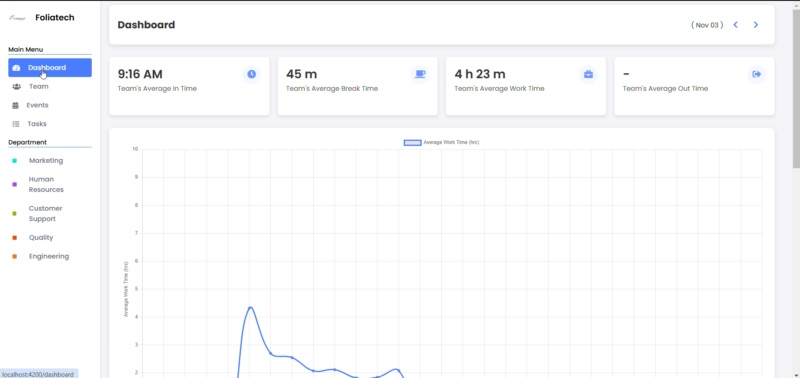
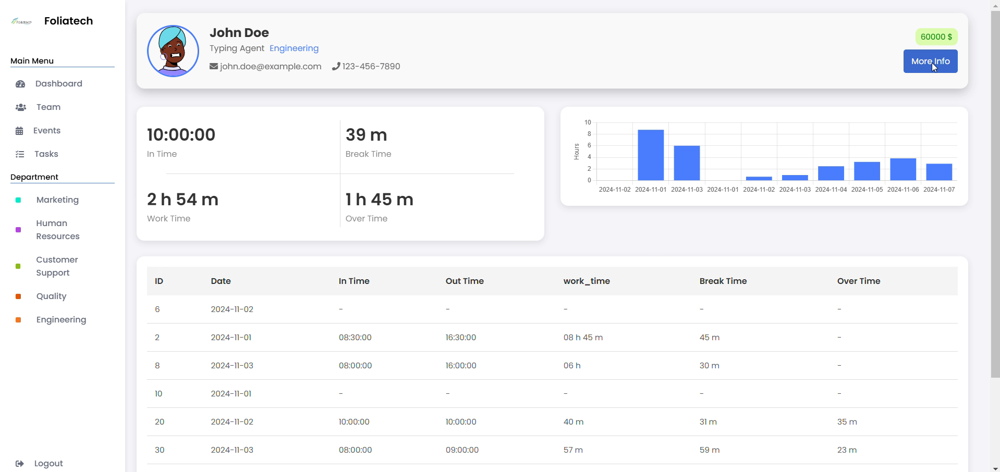
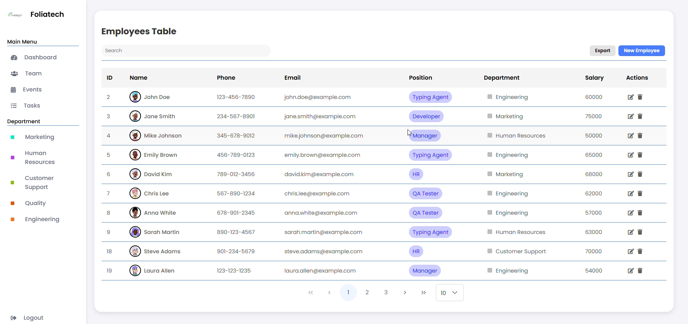
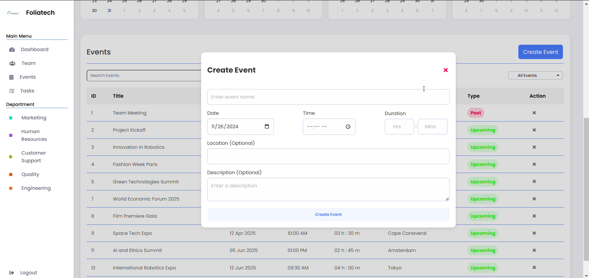

# Angular Productivity Application

A comprehensive employee management system built with Angular and Express, designed for business administrators to efficiently manage employee data, monitor activities, and enhance productivity.



## 📋 Overview

This full-stack application provides a robust solution for:
- Employee information management
- Activity monitoring and tracking
- Task and calendar management
- Department organization
- Document handling (profiles, identification, etc.)

## 🖼️ Screenshots

### Dashboard
  
*A comprehensive overview of key metrics and employee activities*

### Employee Management
  
*Manage employee profiles, documents, and information*

### Calendar & Events
  
*Schedule and track important dates and events*

## 🏗️ Architecture

The application consists of two main components:

1. **Frontend (Angular)**
   - Modern UI with PrimeNG components
   - JWT authentication
   - Role-based access control
   - Responsive design for all device sizes

2. **Backend (Express)**
   - RESTful API design
   - JWT-based authentication with refresh tokens
   - File upload and handling
   - Database integration with Supabase

## 🚀 Getting Started

### Prerequisites
- Node.js (v16+)
- npm or yarn
- Docker and Docker Compose (for containerized deployment)

### Local Development Setup

1. **Clone the repository**
   ```bash
   git clone https://github.com/yourusername/Angular-Productivity-Application.git
   cd Angular-Productivity-Application
   ```

2. **Setting up the server**
   ```bash
   cd server
   npm install
   # Create a .env file with necessary environment variables (see below)
   node src/server.js
   ```

3. **Setting up the client**
   ```bash
   cd client
   npm install
   ng serve
   ```

4. **Access the application**
   - Frontend: http://localhost:4200
   - Backend API: http://localhost:3000

### Environment Variables

Create a `.env` file in the server directory with the following variables:

```
PORT=3000
ACCESS_TOKEN_SECRET=your_access_token_secret
REFRESH_TOKEN_SECRET=your_refresh_token_secret
SUPABASE_URL=your_supabase_url
SUPABASE_KEY=your_supabase_key
```

## 🐳 Docker Deployment

This project includes Docker configuration for easy deployment:

1. **Build and run with Docker Compose**
   ```bash
   docker-compose up -d
   ```

2. **Access the containerized application**
   - Frontend: http://localhost:4200
   - Backend API: http://localhost:3000

## 🧰 Technologies Used

### Frontend
- Angular 18
- PrimeNG UI components
- RxJS for state management
- FullCalendar for event scheduling
- Chart.js for data visualization

### Backend
- Express.js
- JWT for authentication
- Supabase for database
- Multer for file uploads
- PDF generation libraries

## 📚 API Documentation

The backend provides the following API endpoints:

- `/auth` - Authentication endpoints
- `/api/employees` - Employee management
- `/api/events` - Calendar events
- `/api/activity` - Activity tracking
- `/api/department` - Department management
- `/api/task` - Task management

## 🤝 Contributing

Contributions are welcome! Please feel free to submit a Pull Request.

## 📄 License

This project is licensed under the MIT License.
