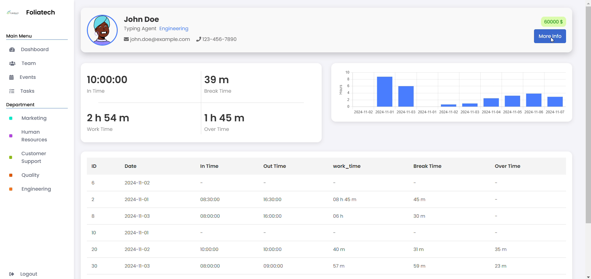
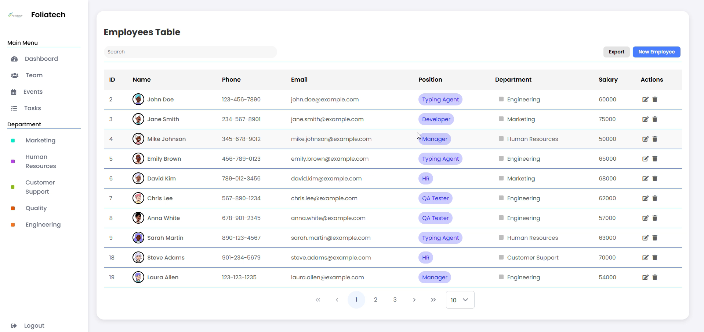
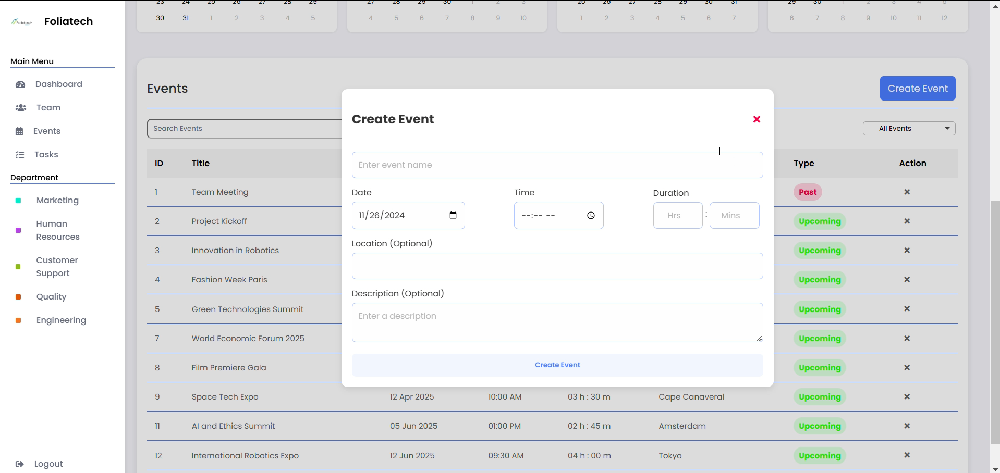
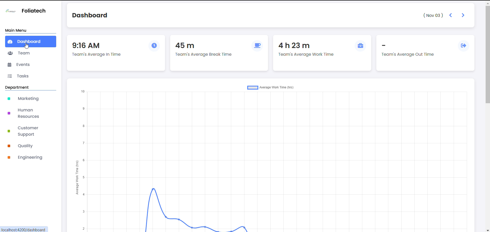

# Employee Management System

This is an Angular-based application designed for business administrators to manage employee data, monitor their activities, and enhance productivity. The system allows for tasks such as employee management, tracking work hours, and managing various administrative processes. It is built with a separate backend API for handling data operations.

## Features

- **Employee Management**: Add, update, and delete employee details.
- **Profile Management**: Upload profile images and essential documents (e.g., CIN, CNSS).
- **Activity Monitoring**: Track and monitor employee activities and productivity.
- **Role-Based Access**: Admin-only access to sensitive employee data and management tools.

## Technologies Used

- **Frontend**: Angular, HTML, CSS, TypeScript
- **Backend**: [Link to Backend Repo] (replace with actual URL)
- **Authentication**: JWT for secure access
- **API Integration**: REST API calls to the backend
- **State Management**: Managed using Angular services and RxJS

## Setup

To run the app locally:

1. Clone the repository:
    ```bash
    git clone Angular-Productivity-Application
    cd src
    ```

2. Install dependencies:
    ```bash
    npm install
    ```

3. Run the development server:
    ```bash
    ng serve
    ```

4. Open the app in a browser by navigating to:
    ```
    http://localhost:4200
    ```

## Screenshots

  
_Description of dashboard or activity monitor interface._

  
_Description of the employee management interface._

  
_Description of the employee management interface._

  
_Description of the employee management interface._

## Backend Repository

The backend API for this application can be found in a separate repository:  
[Backend Repository](https://github.com/MoBourhym/EXPRESS-CRUD-SUPABASE-JWT-FILE-MANIPULATION-.git)

## Contributing

Feel free to fork this project and submit pull requests. Make sure to follow the code of conduct and submit issues for bugs or feature requests.

## License

This project is licensed under the MIT License 
